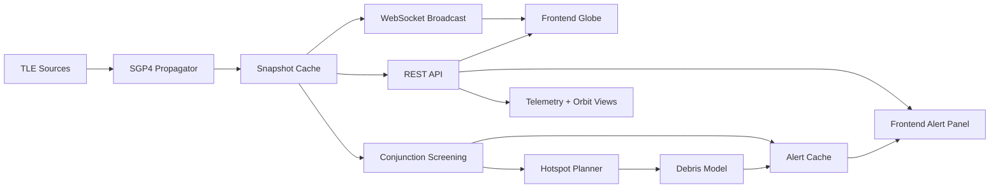
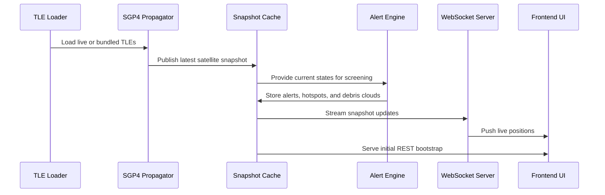

<div align="center">
  <h1>🌌 Orbital Sentinel</h1>
  <p><b>Real-time Satellite Tracking & Conjunction Awareness Platform</b></p>
  
  [](https://opensource.org/licenses/MIT)
  [](https://fastapi.tiangolo.com/)
  [](https://reactjs.org/)
  [](https://cesium.com/)
</div>

<br/>

**Orbital Sentinel** is a cutting-edge real-time satellite tracking and conjunction-awareness prototype. It combines live orbit propagation, alert generation, demo collision scenarios, and an interactive 3D Cesium-based visualization layer to bring the complexities of orbital mechanics and space traffic management directly to your browser.

---

## ✨ Features

- **Real-Time Orbit Propagation:** Ingests Two-Line Element (TLE) sets and propagates tens of thousands of satellite orbits using SGP4.
- **Conjunction Screening:** Screens pairwise miss distances and severity levels to detect potential collisions.
- **Interactive 3D Globe Visualization:** A rich frontend built with Cesium renders thousands of satellite billboards, hotspots, and debris envelopes.
- **Live Telemetry & Tracking:** Broadcasts live position updates at 1 Hz via WebSockets.
- **Simulation Engine:** Run deterministic collision demos with customizable injection scenarios to evaluate safety parameters.
- **Actionable Alerts:** Highlights conjunction alerts with severity levels and automated triage capabilities.

---

## 🏗️ High-Level Architecture



---

## 🚀 Getting Started

### Prerequisites
- Python 3.9+
- Node.js 16+ & npm (or yarn)
- Git

### 1. Backend Setup (FastAPI)
Navigate to the `backend/` directory, set up your Python environment, and start the FastAPI server:
```bash
cd backend
python -m venv venv
source venv/bin/activate  # On Windows: venv\Scripts\activate
pip install -r requirements.txt
uvicorn main:app --reload
```
*The backend API will be running on http://127.0.0.1:8000.*

### 2. Frontend Setup (React + Cesium)
Navigate to the `frontend/` directory, install dependencies, and start the development server:
```bash
cd frontend
npm install
npm run dev
```
*The frontend application will be running on http://localhost:3000.*

---

## 🧭 Runtime Flow



---

## 🛠️ Tech Stack

**Backend Engine:**
- FastAPI (High-performance async Python framework)
- SGP4 (Satellite tracking library)
- WebSockets for real-time streaming

**Frontend Client:**
- React
- CesiumJS (3D geospatial globe visualization)
- Vite (Fast modern build tool)

---

## 📂 Project Structure

- `backend/` - Contains the Python FastAPI server, TLE parser, SGP4 propagator, and conjunction engine.
- `frontend/` - Contains the React & Cesium 3D frontend application.
- `research_paper/` - LaTeX/Markdown documents for academic publications regarding the project.
- `PROJECT_OVERVIEW.txt` - Detailed overview of features, architecture, and future possibilities.
- `PROJECT_SCENARIO.md` - Technical descriptions of demo scenarios and workflows.

---

## 🔮 Future Roadmap

- **Enhanced Physics & Accuracy:** Replace single-epoch screening with Time of Closest Approach (TCA) search and integrate atmospheric drag.
- **Risk Intelligence (ML):** Integrate LSTM predictors for short-term trajectory forecasts and XGBoost for collision risk scoring.
- **Scenario Tooling:** Build a visual scenario editor and batch maneuver planning optimized for cost and safety.
- **Expanded Integrations:** Connect to live TLE streams from public catalogs or private sensor networks and automate alerting (Slack/Email).

---
<div align="center">
  <i>Built with passion to keep our orbits safe.</i>
</div>