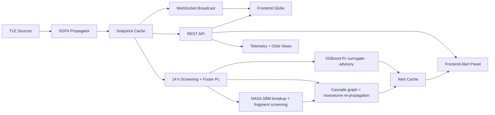
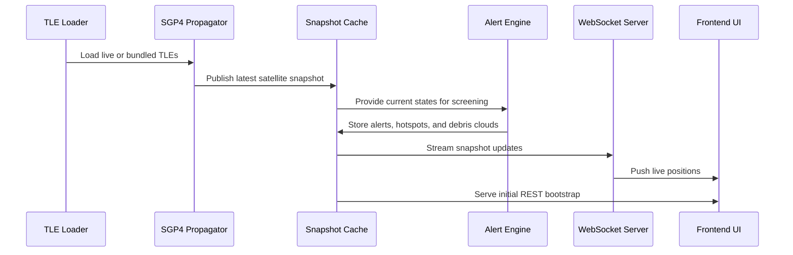

<div align="center">
  <h1>🌌 Orbital Sentinel</h1>
  <p><b>Real-time Satellite Tracking & Conjunction Awareness Platform</b></p>
  
  [](https://opensource.org/licenses/MIT)
  [](https://fastapi.tiangolo.com/)
  [](https://reactjs.org/)
  [](https://cesium.com/)
</div>

<br/>

**Orbital Sentinel** is a cutting-edge real-time satellite tracking and conjunction-awareness prototype. It combines live orbit propagation, alert generation, demo collision scenarios, and an interactive 3D Cesium-based visualization layer to bring the complexities of orbital mechanics and space traffic management directly to your browser.

---

## ✨ Features

> **Reviewers:** every number is computed. Start with
> [docs/HOW_IT_WORKS.md](docs/HOW_IT_WORKS.md), which covers each pipeline
> stage with its equations, code locations, parameter sources, limitations and
> the tests that prove it.

- **Orbit propagation:** SGP4 on TLE sets (Space-Track, a public mirror, or the bundled snapshot), all on a simulation clock.
- **Future-window conjunction screening:** 24 h look-ahead with a KD-tree per time step and Brent-refined TCA. Collision probability is Foster 2-D Pc with a TLE-age covariance model and per-object hard-body radii.
- **ML surrogate (advisory):** an XGBoost regressor of log10 Pc, trained on Foster-labelled encounters, with held-out metrics in the model card. It never replaces the physics Pc.
- **Collision to debris:** NASA Standard Breakup Model fragments, propagated with J2 + drag and screened against the catalogue.
- **Cascade analysis:** an alert graph (collision event → fragments → satellites → neighbours) with BFS depth and P(hit) = 1 − Π(1 − Pc).
- **Manoeuvre planning:** candidate burns are re-propagated and Pc is recomputed; fuel is costed with the rocket equation.
- **Agencies:** owners from the CelesTrak SATCAT snapshot, with authority-gated commanding.
- **3D visualisation:** a Cesium globe with live positions streamed over WebSocket at 1 Hz.

---

## 🏗️ High-Level Architecture



---

## 🚀 Getting Started

### Prerequisites
- Python 3.11+
- Node.js 16+ & npm (or yarn)
- Git

### 1. Backend Setup (FastAPI)
Navigate to the `backend/` directory, set up your Python environment, and start the FastAPI server:
```bash
cd backend
python -m venv venv
source venv/bin/activate  # On Windows: venv\Scripts\activate
pip install -r requirements.txt
uvicorn main:app --reload
```
*The backend API will be running on http://127.0.0.1:8000.*

### 2. Frontend Setup (React + Cesium)
Navigate to the `frontend/` directory, install dependencies, and start the development server:
```bash
cd frontend
npm install
npm run dev
```
*The frontend application will be running on the port Vite prints (default http://localhost:5173).*

---

## 🧭 Runtime Flow



---

## 🛠️ Tech Stack

**Backend Engine:**
- FastAPI (High-performance async Python framework)
- SGP4 (Satellite tracking library)
- WebSockets for real-time streaming

**Frontend Client:**
- React
- CesiumJS (3D geospatial globe visualization)
- Vite (Fast modern build tool)

---

## 📂 Project Structure

- `backend/` - Contains the Python FastAPI server, TLE parser, SGP4 propagator, and conjunction engine.
- `frontend/` - Contains the React & Cesium 3D frontend application.
- `research_paper/` - LaTeX/Markdown documents for academic publications regarding the project.
- `PROJECT_OVERVIEW.txt` - Detailed overview of features, architecture, and future possibilities.
- `PROJECT_SCENARIO.md` - Component map and demo workflow.
- `docs/HOW_IT_WORKS.md` - Judge-facing description of every computation, with verification commands.

---

## 🔮 Future Roadmap

- **Measured covariance:** ingest CDMs/ephemerides instead of the TLE-age covariance model.
- **Masses:** a real mass catalogue (e.g. DISCOS) instead of RCS/type defaults.
- **Long-term debris evolution:** a population model beyond the 24 h screening window.
- **Expanded integrations:** automated alerting (Slack/Email) and live TLE streams by default.

---
<div align="center">
  <i>Built with passion to keep our orbits safe.</i>
</div>